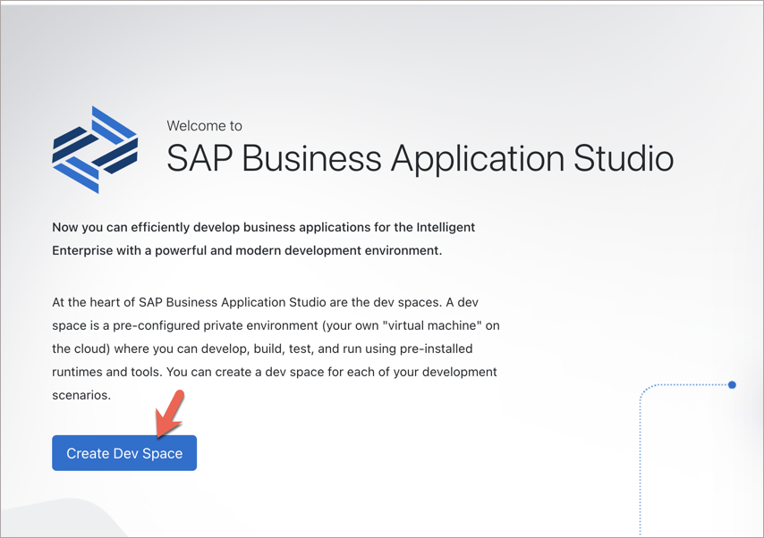
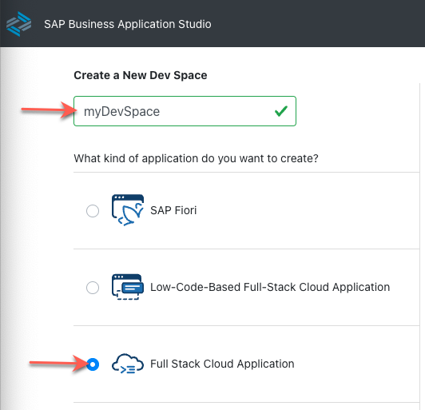
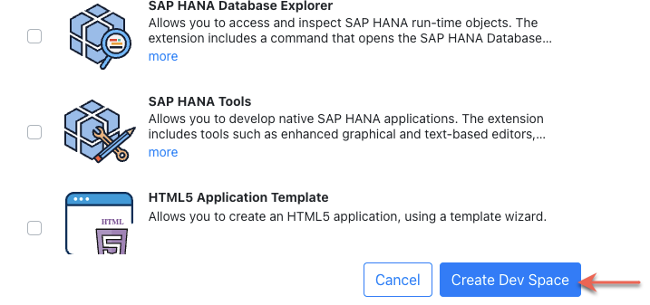
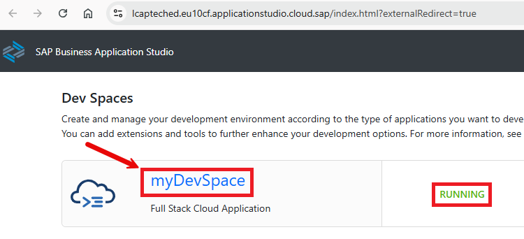
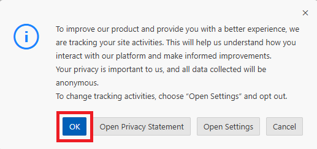
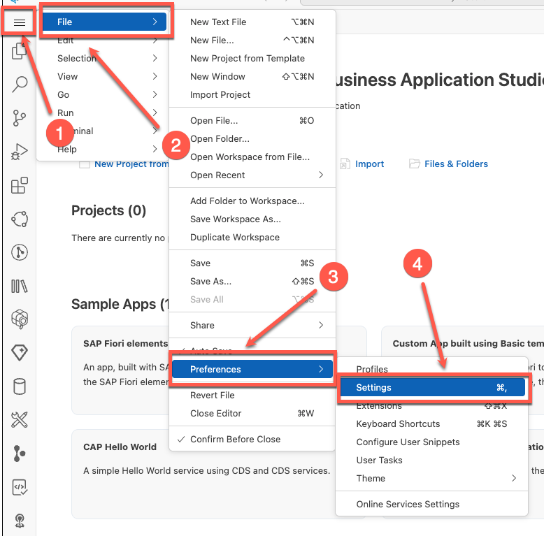
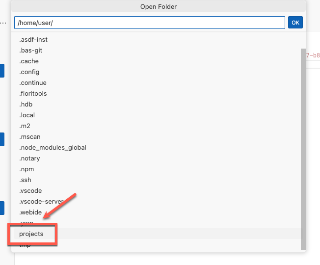

# Getting Started - Setting up your Development Environment

As a particpant of the hands-on, you should already be setup with access to the SAP Business Application Studio landscape below which you can use as your development environment.

## Accessing SAP Business Application Studio

Navigate to https://lcapteched.eu10.build.cloud.sap/lobby

<span style="color:red">**NOTE:  BAS AI is only supported on Chrome.  Please ensure you use the Chrome Browser.** </span>


## Accessing the Dev Space Manager

On the SAP Build landing page, click button **Switch Product** in the top right corner and select **Dev Space Manager**.

## Creating the Development Space

<span style="color:red">Your dev space has been precreated for the hands-on session.
If your dev space manager shows FioriAppsGenAI, continue directly with step </span> [Opening the Development Space](#opening-the-development-space)

If the **Welcome to** landing page is shown instead, you have to create a new dev space as follows.


Click on the button **Create Dev Space**.



Enter a name for your development space and select application profile **Full Stack Cloud Application**.



In the lower right corner of the page press button **Create Dev Space**.



## Opening the Development Space

Make sure your development space has status running. If stopped, click the start button. 

Once running, click on the development space name to open it.  This can take some time.



Click **OK** in the popup window to accept the tracking settings in the newly created dev space.




## Enable Generative AI features with SAP Fiori Tools

Next you will need to enable the feature toggle to allow for generative AI with SAP Fiori tools.  Please follow these steps:

1. Click on the three lines icon in the top left hand side of the window.
2. Select **File**
3. Select **Preferences**
4. Then select **Settings**




Click on the file icon in the top right of the screen to enable the settings file to appear.


You will be presented with a blank file apart from 2 curly braces:


Between the curly braces, enter the text:

```JSON
"sap.ux.help.testBetaFeatures.enableFioriAIAppModeler": "165a0e31-35ea-4bee-8d47-b8593435a82g"
```

Your file should look as follows:


Click on the `x` to close the settings window.

## Open your project folder

Open the explorer icon from the left hand side:


And select **Open Folder** button


Select the **Projects** folder from the drop down



Click **OK** and your window will reload


## Summary

With the setup procedure done, you now have completed:

- Access to SAP Business Application Studio
- Creation of your development space
- Enabling of the SAP Fiori tools AI features

Continue to - [Exercise 1 - Generate an SAP Fiori app from business requirements](../ex1/README.md)