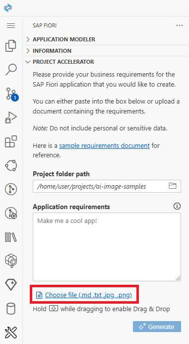
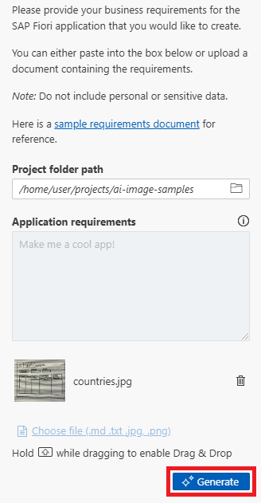
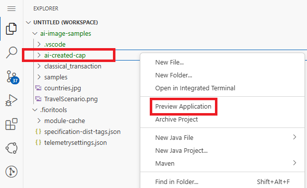
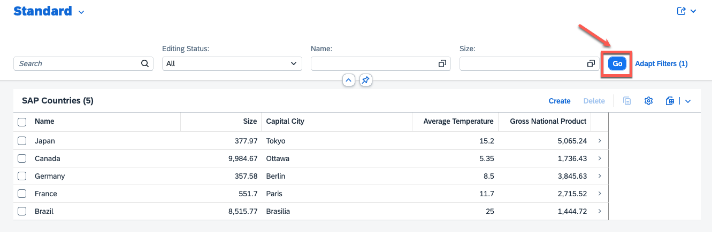

#  Exercise 2 - Generate an SAP Fiori app from an image

In this exercise, we will create a number of SAP Fiori apps, but instead of using a text document as input, we will use images of the applications that we want to create.

## Exercise 2.1 Downloading the sample images into SAP Business Application Studio

From the menu select **View -> Command Palette**


Sarch for command **git clone** and select it.


Paste the repository link below into the input field and hit enter.

```
https://github.com/ianquigley-sap/ai-image-samples
```

Choose the projects folder for the repository location and click **OK**


Click **Open** to open SAP Business Application Studio with the new repository.


### Enable Additional AI Features with Fiori Tools

This manual configuration step is only required in the current beta phase of the SAP Fiori AI tools features.

From the menu select **File -> Add Folder to Workspace...**


1. **Delete ~~projects/~~** from the input field.


2. Select folder **/home/user/.fioritools** and press **Ok**. <br>
<span style="color : red">**Please check that there is no '/projects' in the input field.**</span>


Both folders should appear together in a workspace as shown below, which is required for some of the subsequent exercises to work properly.


## Exercise 2.2 Launching the SAP Fiori tools AI Project Accelerator with image input

Click on the **SAP Fiori** icon in the left hand side panel.\
Similar to exercise 1, ensure that the SAP Fiori tools panel is open with the AI **Project Accelerator** displayed (you can close the **Application Modeler** and **Information** sections):


Click on the **Choose file** link.



Select the **countries.jpg** file and click **OK**


A thumbnail of the image should appear in the input box.  Click **Generate** to start generating an application directly from the image.



The application will start generating, give it some time.


After the app has generated, you may be prompted to select a workspace or root directory. Please choose the **ai-image-samples** folder.


## Exercise 2.3 Previewing the generated application

Click on the **Explorer** icon in the side panel and see that you now have an **SAP Fiori** app which was generated from an image.


Right click the **ai-created-cap** folder and click the **Preview Application** button from the context menu.



Select the **start** script from the **Preview Options** dropdown when prompted.


The application should launch in a new browser tab. Click **Go** to see the sample data that the AI has created.

_Note: if the application created in the previous exercise is still running, the launch might be interrupted by an 'address already in use' error. Navigate to the previous workspace and terminate the application to resolve this issue._



If the application failed to launch and you see a message in the terminal stating that the port is already in use (from previewing our application from the last exercise). Navigate to the terminal for the last preview and use CTRL + C to stop it from running. Then try previewing your application again.


## Summary

You've now successfully generated a SAP Fiori app using a sketch of the application you'd like to generate.

Continue to - [Exercise 3 - Generate an SAP Fiori app using images and text](../ex3/README.md)
