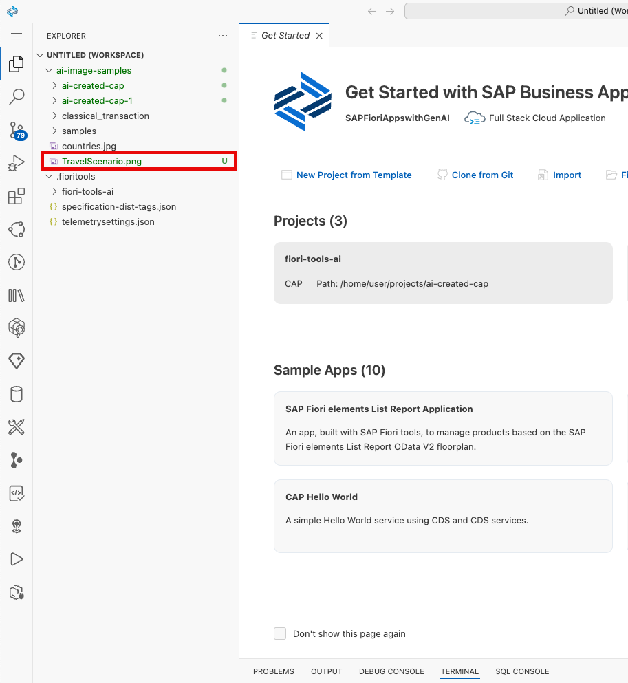
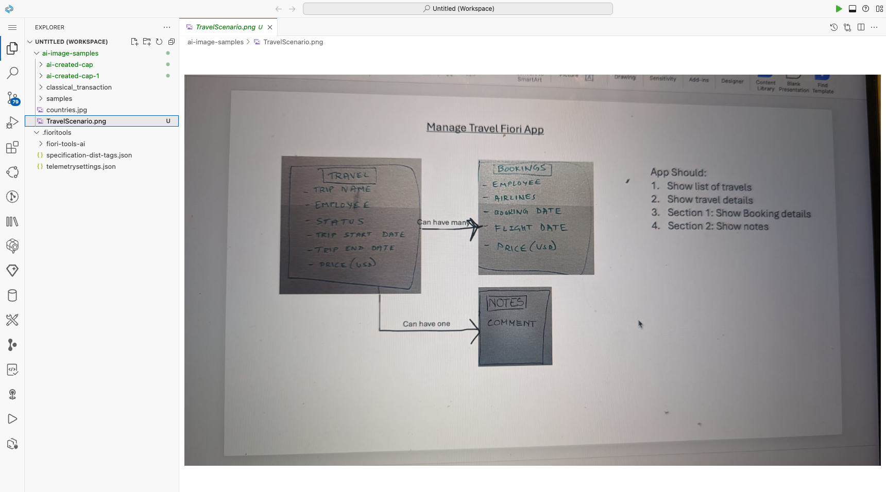
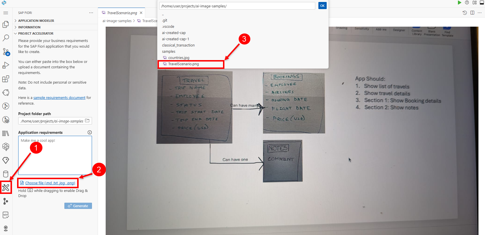
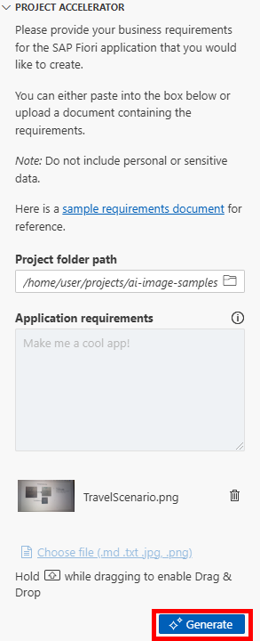

#  Exercise 5 - Generation and extending an app 

In this exercise you will use your learned skill of generating a fiori app from a picture and extend this app with the flexible programming model.

## Exercise 5.1 Using the other sample images

Navigate to you explorer in the business application stusio and look for the **TravelScenario.png** picture. Double click on the picture to see the preview.
  

The Preview should look like this:

1. Next, navigate to **SAP Fiori** in your Business application menue on the left side.
2. Click on **Choose file (md, txt, jpg)**
3. Select the **TravelScenario.png** from the drop down.

Click **Generate**

## Summary

You've now successfully completed the hands-on workshop. Congratulations!
