#  Exercise 5 - Generation and extending an app 

In this exercise you will use your learned skill of generating a Fiori app from a picture and extend this app with the flexible programming model.

Please be aware that you need to complete: [Exercise 0 - Getting Started - Setting up your Development Environment
](../ex0/README.md) and [Exercise 2.1 - Generate an SAP Fiori app from an image](../ex2/README.md)  before you can start Exercise 5.

## Exercise 5.1 Using the other sample images

Navigate to you explorer in the business application stusio and look for the **TravelScenario.png** picture. Double click on the picture to see the preview.
  

The Preview should look like this:

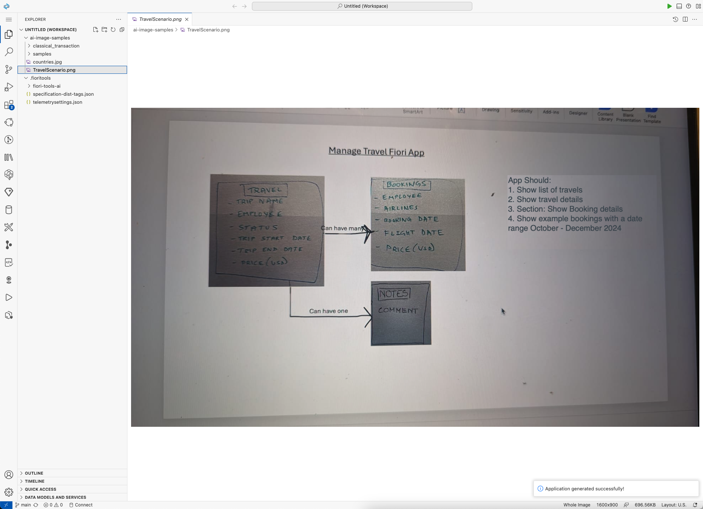

1. Next, navigate to **SAP Fiori** in your Business application menu on the left side.
2. Click on **Choose file (md, txt, jpg)**
3. Select the **TravelScenario.png** from the drop down.

Click **Generate**

Once the app has been successfully generated you should see a **accept project** and **preview** button.
Please click now the **preview** button to open up the app in a preview tab.

The preview of the newly generated app should look like the following picture.

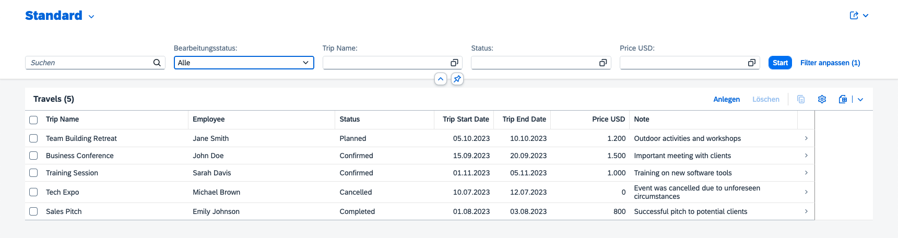

As a next step we want to enhance our Ai generated app. To do this switch back from your **preview** tab in your browser to your **Business Application Studio** tab again. 
Now look for your **staging area** section in the left hand navigation. Now hover your mouse over **STAGING AREA** to reveal the **App Modeler** button. Please press **Start App Modeler**.

Now you can see the page map for our Ai gernerated Travel app. Please check if you can see the **Ai Generator staging area** sign up top. If this is the case, press the edit button on the list report.

As the next step, please find the columns section and press the **add column** button.

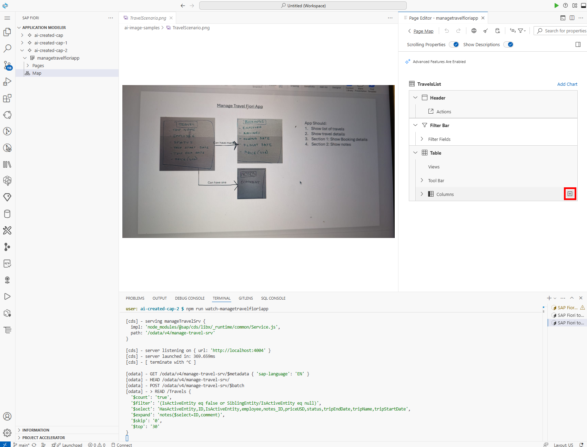

Now we want to select *Add Basic Columns** from the drop down menu.

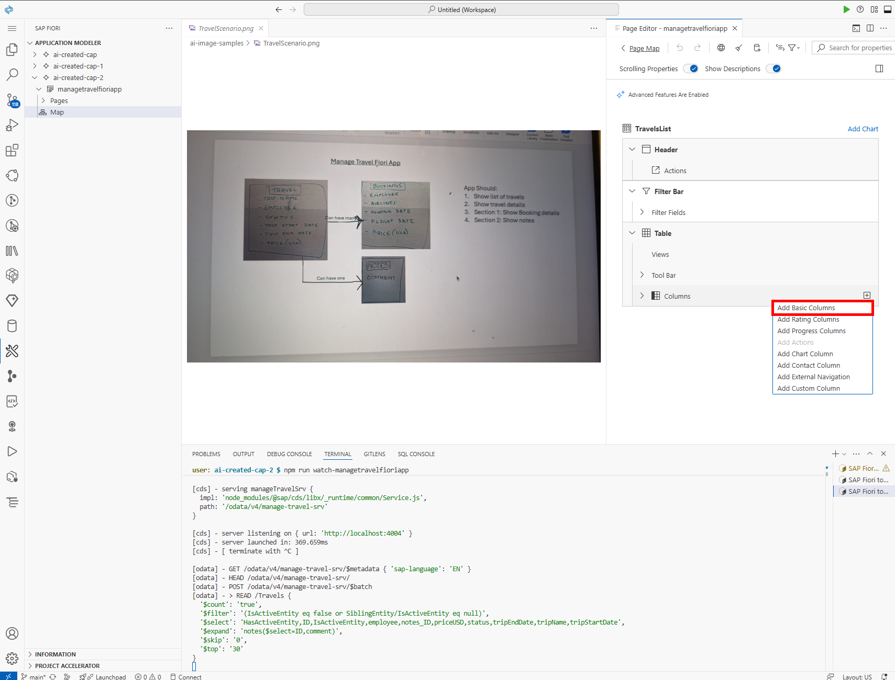

Please open up the dropdown.

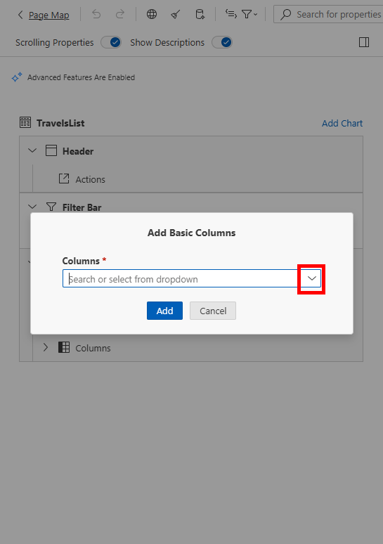

In the input field, type in **Business** and set the checkmark on the left hand side radio box.

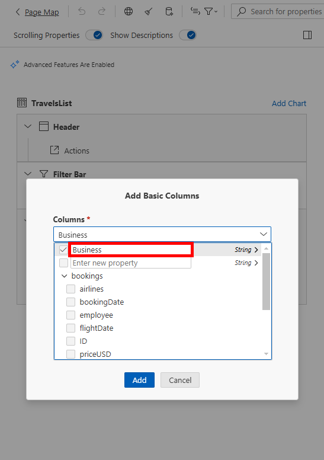

1. Now click on **String** on the right hand side.
2. Select **Boolean** 

Click Add.

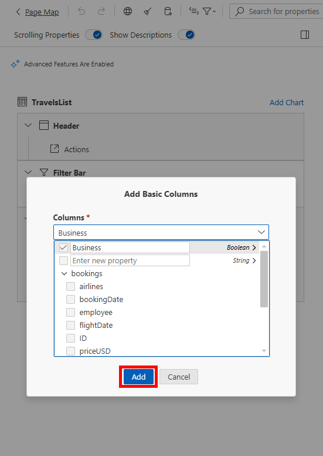

Now we want to add a second column. Please repeat pressing the **add column** button the right hand side again.

Open up the dropdown again.

1. In the input field, type in **Destination** and set the checkmark on the left hand side radio box. This time we want to leave the selection on the right hand side on **String**. 
2. Click on **Add**

In the Columns section you now can see our newly added column (Business & Destination). Now we want to move to the middle on the list. To do so click on the up arrow shown in the picture. 

Once this is done, we want to preview the app again to see the newly created columns in action. Switch to your **preview** tab in your browser and click **1.GO** (Start in German). This will reload the app and reveal the new columns Business and Destination. **(If you dont see the columns after pressing **GO** please try the next step)**

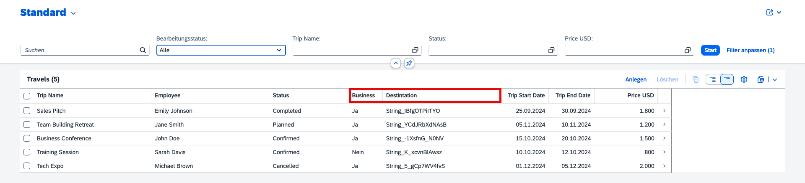

 If you successfully previewed the two new columns (Business and Destination). We can now press the **Use Ai to refine Test Data** Button. 

 

 Click on **Generate**

 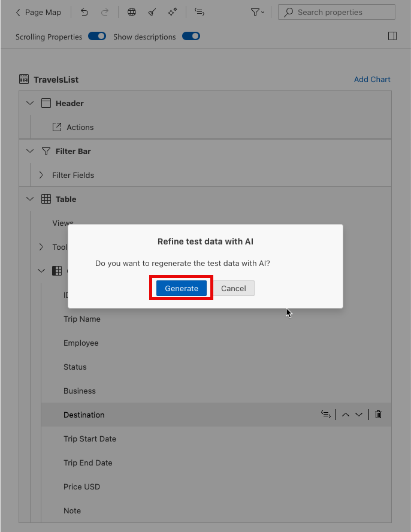

You can now switch back to the preview tab in your browser click **Go** and you should see the Ai refined Test Data.

In case you the reload does not work please switch to your **Business Application Studio** tab and go to your Terminal at the bottom of the page.  
Click inside of the terminal field and press: 
**control + c (on Mac)** 
**STRG + c (on Windwos)** 

You should now see **(CDS) - my watch has ended 
user: fiori-tools-ai $**

Now you can press the **Preview** button on the left side again. 

If you see that Port 4004 is already in use please see the next step.

You may see a message in the terminal stating that the port is already in use (from previewing our application from exercise 1), click **Return/Enter** to use any other port for preview

As the next step we want to switch the layout of the app to the flexible column layout.  
1. To have more room in the business application studio we can now close the preview. 
2. Now click on **Page View**

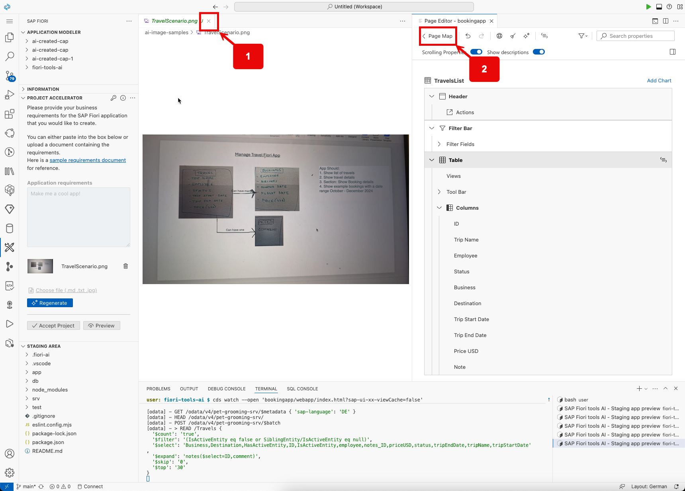

Navigate to the Felxible Column Layout on the right side. Switch from the **Standard Layout** to the **Fexible Column Layout**. For the 2 column layout select **Mid-Expanded**.

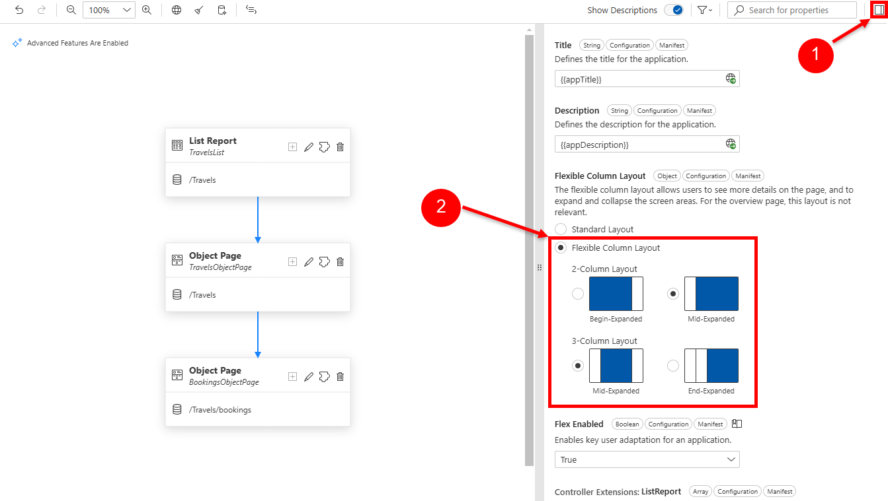

As a next step switch to you **Preview** tab again to reload your app with:  
**STRG + R (Windows)** 
**Command + R (Mac)**   **
After this step click on the first item in the list to experience the flexible column layout.

Now click on the first line on the object page

The last step within out Ai Staging Area will be pressing the **Accepting files** button to move the project out of our staging area.

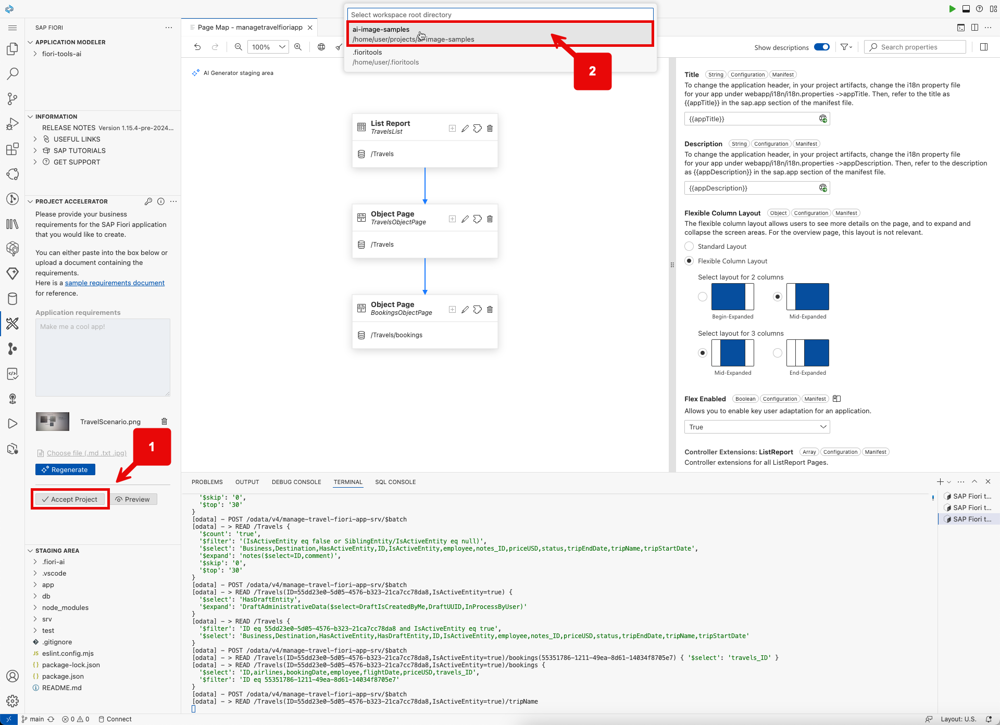

1. Please press **Agree** on the bottom right side of the screen.  
2. Please select the first option from the dropdown

## Summary

You've now successfully completed the hands-on workshop. Congratulations!
